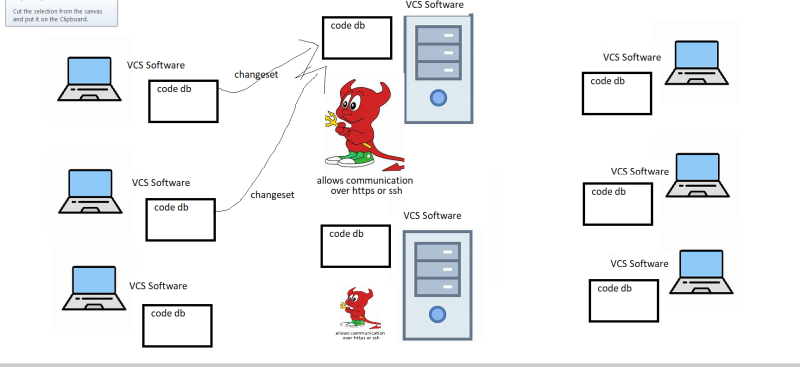

# GIT

## Repository

* Repository is a Data storage solution where the history is maintained.
* Generally for this versioning is used and along with every version some meta data like reason for change is also maintained.
* Generally Repositories also have the option to view differences between versions.
* W.R.T CI/CD Pipelines we have two major repositories
  * Source Code Repository
  * Package Repository
 
### Version Control System (VCS)

* VCS is used to store generally code (any files)
* This is a software which helps organizations to maintain the source code.
* VCS helps in maintaining history of changes
* VCS allows us to maintain track of different releases which we give to customers
* VCS allows parallel development by multiple developers
* Software which allows us to store code along with history is called as Version Control Systems.

### Evolution of VCS

* Single User VCS => VSS
* Multi User VCS => Subversion (SVN)
* Distributed VCS => Bitkeeper, Git
  
### Architectures of Version Control System

* Centralized Version Control Systems
  .webp)
* Distributed Version Control Systems
   