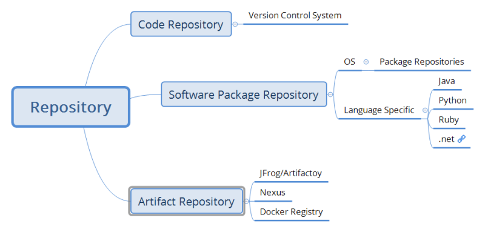
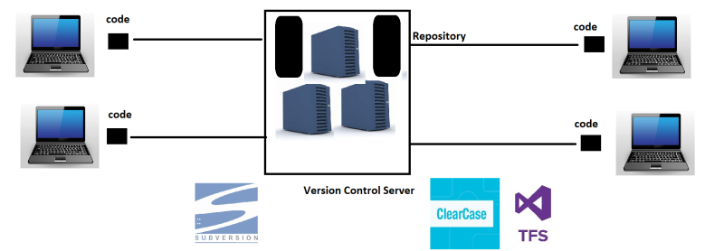
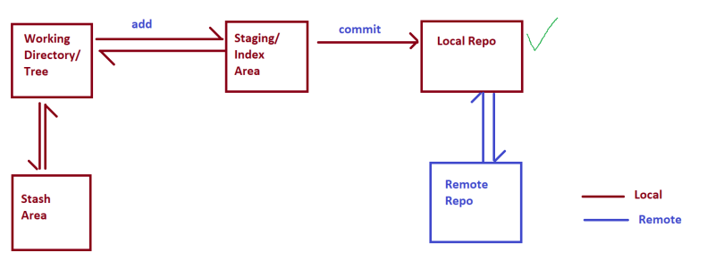

# GIT

## Repository

* `Repository is a Data storage(any storege ) solution where the history is maintained.`
* Generally for this versioning is used and along with every version some meta data like reason for change is also maintained.
* Generally Repositories also have the option to view differences between versions.
* W.R.T CI/CD Pipelines we have two major repositories
  * Source Code Repository
  * Package Repository

### Repository types

  

### Version Control System (VCS)

* VCS is used to store generally code (any files)
* This is a software which helps `organizations to maintain the source code.`
* VCS helps in `maintaining history of changes`
* VCS allows us to `maintain track of different releases which we give to customers`
* VCS allows `parallel development by multiple developers`
* `Software which allows us to store code along with history` is called as Version Control Systems.

### Evolution of VCS

* Single User VCS => VSS
* Multi User VCS => Subversion (SVN)
* Distributed VCS => Bitkeeper, Git
  
### Architectures of Version Control System

* local version control systems
  * it was a single machine VCS. if have many develpoers(more than one ) all the developers log into same server or machine then write a code (`single machine multi user`)
  * its not scalable
* Centralized Version Control Systems
  
  * Examples:
    * Subversion (SVN)
    * Perforce
    * IBM ClearCase
* Distributed Version Control Systems
   
  * Examples:
    * Mercurial
    * Git
    * Bazaar
* While using we have two options for Remote Repositories
  * Self-Hosted
    * Host it on your own 
    * Options
      * Gitolite
      * Git lab Selfhosted  
  * Cloud-Hosted
    * Hosted by some service provider.
    * Options
      * GitHub
      * GitLab
      * Azure Source Repos
      * AWS Code Commit
      * Bit Bucket 
    
* Git is the most popular Version Control System.
* Git was created by Linus Torvalds (Who create Linux Kernel)
* This version control system was created to manage Linux Code base.
* The primary objective behind Git was to implement & design a version 
  control system that was distributed, reliable and fast.
* Torvalds had three criteria
  * distributed
  * effecient
  * safe from corruption
  
### GIT workflow

